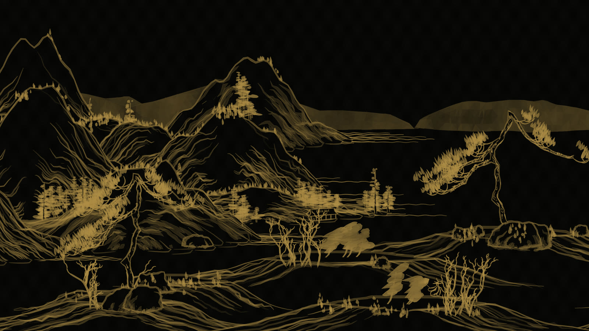
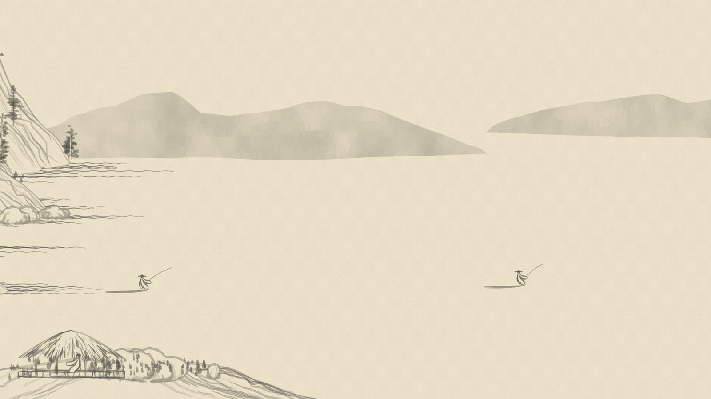

# Shan Shui screensaver

A Windows screensaver that slowly scrolls an endless procedurally generated Chinese landscape. The landscape comes from [{Shan, Shui}*](https://github.com/LingDong-/shan-shui-inf) by Lingdong Huang, the repository this is forked from.

- **Light** theme: grey ink on paper, as in the original.
- **Dark** theme: gold ink on black.
- Adjustable scroll speed. Each monitor gets its own landscape. Moving the mouse or pressing a key exits.
- Live preview in the small monitor picture of Windows' *Screen saver settings* dialog.




## Install
1. Download `ShanShui-screensaver-win-x64.zip` from the [latest release](https://github.com/CiphemonJY/shan-shui-inf/releases/latest) and extract it.
2. Double-click `install.cmd`. It copies the screensaver to `%LOCALAPPDATA%\Programs\ShanShui`, selects it for your user (no admin needed), and opens *Screen saver settings*.
3. There, set the wait time, click **Settings…** to choose Light or Dark and the speed, then click **OK**.

To remove it, run `uninstall.cmd`. It deletes the program, its settings (`HKCU\Software\ShanShuiSaver`) and its browser cache (`%LOCALAPPDATA%\ShanShuiSaver`), and deselects it if it is the active screensaver.

Alternatively, right-click `ShanShui.scr` and choose **Install**.

**Requirements:** Windows 10 or 11 (x64) with the [Microsoft Edge WebView2 Runtime](https://go.microsoft.com/fwlink/p/?LinkId=2124703). WebView2 is preinstalled on Windows 11 and current Windows 10. .NET is bundled, so there is nothing else to install.

## Build
Requires Python 3 and the .NET 9 SDK.
```
powershell -ExecutionPolicy Bypass -File package.ps1
```
This runs `build.py`, which combines the fork's root `index.html` generator with `template.html` into `web/index.html`. It then publishes a self-contained `ShanShui.scr` and zips it with the install scripts into `dist/`.

For a quick framework-dependent build: `python build.py`, then `dotnet publish ShanShui.csproj -c Release -o bin/out`, then rename `ShanShui.exe` to `ShanShui.scr`. To preview the page in a browser, serve `web/` and open `index.html?theme=dark&speed=30&seed=42`.

## How it works
- The upstream generator runs unmodified in a Web Worker. The page asks it for 1024-px tiles ahead of the viewport and scrolls them with a GPU transform.
- Each tile includes chunks from ±1600 world units and overlaps its neighbour by 1 px, so the joins between tiles are seamless.
- Dark mode uses an SVG `feColorMatrix` filter that maps ink density to gold.
- The C# host (`Program.cs`) opens a borderless WebView2 on each screen and exits on input. It serves the embedded page from memory rather than extracting it to disk.
- For `/p <hwnd>` it re-parents itself into the Settings dialog's preview picture, scales the speed to that size, and exits when that window goes away.

## Licence
The screensaver code in this folder is MIT, © James Yeung (`LICENSE`). The landscape generator is MIT, © Lingdong Huang (`../LICENSE`).
